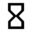

#  genug!

https://genug.co

## tooling

### backend

https://medium.com/@jsilvax/a-workflow-guide-for-lerna-with-yarn-workspaces-60f97481149d

https://zeit.co/docs/v2/deployments/builders/overview/

## App

https://github.com/zeit/now-examples/tree/master/express-twitter-dreamify/routes
https://reactjs.org/docs/thinking-in-react.html

### PWA

https://www.freecodecamp.org/news/how-to-build-a-pwa-with-create-react-app-and-custom-service-workers-376bd1fdc6d3/

### i18n

https://dev.to/stereobooster/i18n-of-react-with-linguijs-3-5h6g
https://github.com/stereobooster/react-lingui-example/blob/master/src/I18nLoader.js

## Notifications

https://expo.canny.io/feature-requests/p/serverless-scheduled-push-notifications
https://console.firebase.google.com/u/0/project/genugco/overview
